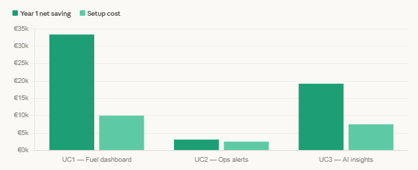
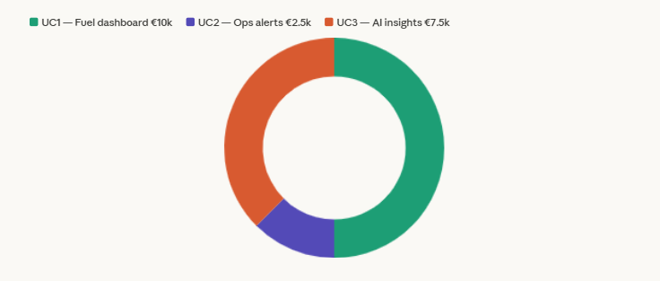

# Cost Analysis: AI Implementation for Chleo SME
**Project 5 — SilverTrust AI Consulting Simulation**  
**Prepared by:** Pedro  
**Date:** March 2026  
**Client:** Chleo — Regional Haulage SME, 50–200 employees, Spain  

---

## 1. Assumptions

- Fleet size: 50 trucks
- Average monthly revenue: ~€850,000 (€10.2M annually)
- Current net margin: ~2.5% (~€255,000/year)
- Current annual fuel spend: ~€900,000
- Diesel price: ~€1.57/litre (Q4 2024 EU average)
- All costs in EUR, VAT excluded
- Free-tier APIs used where possible during pilot phase

---

## 2. Use Case 1 — Fuel Cost Intelligence Dashboard

### Setup costs
| Item | Cost |
|---|---|
| Data pipeline development (connecting TMS + fuel cards) | €4,000 |
| Dashboard design and build (Tableau) | €2,000 |
| AI insight agent development | €2,500 |
| LangSmith monitoring setup | €500 |
| Testing and deployment | €1,000 |
| **Total setup** | **€10,000** |

### Monthly running costs
| Item | Cost/month |
|---|---|
| OpenAI API (GPT-4o-mini, ~500 insights/month) | €15 |
| LangSmith monitoring (free tier) | €0 |
| Tableau Cloud (if shared) | €70 |
| Hosting/infrastructure | €50 |
| **Total monthly** | **€135** |

### ROI calculation
- 5% fuel reduction on €900,000 annual spend = **€45,000 saved/year**
- Setup cost: €10,000
- Annual running cost: €1,620
- **Net year 1 saving: €33,380**
- **Payback period: 2.7 months**

---

## 3. Use Case 2 — Automated Operations Alerts (n8n)

### Setup costs
| Item | Cost |
|---|---|
| n8n workflow design and build | €1,500 |
| Gmail + Google Sheets + Airtable integration | €500 |
| Testing and documentation | €500 |
| **Total setup** | **€2,500** |

### Monthly running costs
| Item | Cost/month |
|---|---|
| n8n cloud subscription | €20 |
| Google Workspace (if not existing) | €6 |
| **Total monthly** | **€26** |

### ROI calculation
- Saves ~45 min/day of manual dispatch and reporting
- At €25/hour operations manager cost = €281/month saved
- **Payback period: 9 days**

---

## 4. Use Case 3 — AI Insight Generator with LangSmith Monitoring

### Setup costs
| Item | Cost |
|---|---|
| LangChain/LangGraph agent development | €4,000 |
| LangSmith dataset creation and experiment setup | €1,000 |
| Evaluator design and testing | €1,000 |
| Integration with dashboard | €1,500 |
| **Total setup** | **€7,500** |

### Monthly running costs
| Item | Cost/month |
|---|---|
| OpenAI API (GPT-4o-mini, weekly insights) | €25 |
| LangSmith (free tier covers this project) | €0 |
| **Total monthly** | **€25** |

### ROI calculation
- Insight-driven decisions: estimated 3% additional fuel saving = **€27,000/year**
- Setup cost: €7,500
- Annual running cost: €300
- **Net year 1 saving: €19,200**
- **Payback period: 4.5 months**

---

## 5. Total Investment Summary

| | Setup Cost | Monthly Cost | Annual Running | Year 1 Net Saving |
|---|---|---|---|---|
| UC1 — Fuel Dashboard | €10,000 | €135 | €1,620 | €33,380 |
| UC2 — Ops Alerts | €2,500 | €26 | €312 | ~€3,100 |
| UC3 — AI Insights | €7,500 | €25 | €300 | €19,200 |
| **TOTAL** | **€20,000** | **€186** | **€2,232** | **€55,680** |

**Total Year 1 ROI: 178%**  
**Overall payback period: ~4.3 months**

---

## 6. Phased Investment Option

Given Chleo's thin margins (2-3% net), a phased approach reduces upfront risk:

**Phase 1 (Month 1-2): €2,500**
- n8n automated alerts only
- Immediate operational efficiency
- Builds trust before larger investment

**Phase 2 (Month 3-6): €10,000**
- Fuel intelligence dashboard
- AI insights begin generating fuel savings
- ROI becomes visible

**Phase 3 (Month 6-12): €7,500**
- Full LangSmith monitoring
- Advanced agent capabilities
- System fully operational

---

## 7. Risks and Contingencies

| Risk | Probability | Cost Impact | Mitigation |
|---|---|---|---|
| Data integration complexity | High | +€3,000–5,000 | Budget 20% contingency |
| Driver resistance to monitoring | Medium | +€1,000 training | Change management plan |
| API cost overrun | Low | +€100–200/month | Set spending caps |
| Delayed ROI due to data quality | Medium | 1-2 month delay | Start with clean synthetic data |
