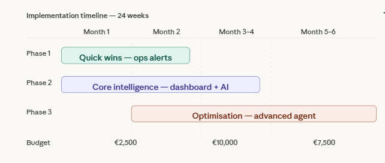

# Timeline Estimate: AI Implementation for Chleo SME
**Project 5 — SilverTrust AI Consulting Simulation**  
**Prepared by:** Pedro  
**Date:** March 2026  
**Client:** Chleo — Regional Haulage SME, 50–200 employees, Spain  

---

## Implementation Roadmap



### Phase 1 — Quick Wins (Weeks 1–4)
**Budget: €2,500 | Goal: Build trust, show immediate value**

| Week | Activity | Deliverable |
|---|---|---|
| 1 | Kickoff meeting, data audit, system inventory | Data audit report |
| 2 | n8n workflow design and build | Fuel anomaly alerts live |
| 3 | Gmail + Google Sheets + Airtable integration | Logging system live |
| 4 | Testing, refinement, ops team training | Workflow documentation |

**Milestone:** Operations manager receiving automated daily alerts by end of week 4.

---

### Phase 2 — Core Intelligence (Weeks 5–12)
**Budget: €10,000 | Goal: Fuel cost visibility and AI insights**

| Week | Activity | Deliverable |
|---|---|---|
| 5–6 | Data pipeline: connect TMS + fuel card data | Clean integrated dataset |
| 7–8 | Tableau dashboard build | Fleet Overview + Fuel Intelligence pages |
| 9–10 | AI insight agent development | Agent generating weekly insights |
| 11 | LangSmith monitoring setup | Transparency dashboard live |
| 12 | UAT with Chleo and ops team | Sign-off and go-live |

**Milestone:** Chleo can open Tableau every Monday and see last week's fuel anomalies with AI-generated explanations by end of week 12.

---

### Phase 3 — Optimisation (Weeks 13–24)
**Budget: €7,500 | Goal: Advanced insights, evaluation, continuous improvement**

| Week | Activity | Deliverable |
|---|---|---|
| 13–14 | LangGraph agent upgrade | Multi-tool agent live |
| 15–16 | LangSmith evaluation pipeline | Automated quality scoring |
| 17–18 | Driver performance scoring module | Driver dashboard |
| 19–20 | Predictive maintenance module | Maintenance risk alerts |
| 21–22 | Cost forecasting with ETS 2 projections | 2027 carbon cost model |
| 23–24 | Full system review and optimisation | Final handover report |

**Milestone:** Fully autonomous fleet intelligence system running with monthly human review by end of week 24.

---

## Summary Timeline

```
Month 1    Month 2    Month 3    Month 4    Month 5    Month 6
|----------|----------|----------|----------|----------|----------|
[Phase 1 - Quick Wins    ]
           [Phase 2 - Core Intelligence              ]
                                 [Phase 3 - Optimisation          ]
```

---

## Key Dependencies

- **Data access** — requires TMS and fuel card API credentials from Chleo by Week 1
- **Driver buy-in** — change management communication needed before Week 7 (performance scoring)
- **IT infrastructure** — cloud accounts (n8n, OpenAI, LangSmith) set up by Week 1
- **Chleo availability** — 2-3 hours/week for reviews and feedback during Phase 2

---

## Assumptions

- One dedicated AI consultant (Pedro/SilverTrust) for the full engagement
- Chleo provides one internal point of contact (operations manager)
- Existing telematics system has API access (Webfleet or Samsara)
- Existing fuel card provider has API access (DKV or UTA)
- No major data quality issues discovered during audit (if found, add 2-3 weeks)

---

## Total Engagement Summary

| Phase | Duration | Budget | Key Output |
|---|---|---|---|
| Phase 1 | 4 weeks | €2,500 | Automated alerts live |
| Phase 2 | 8 weeks | €10,000 | Dashboard + AI insights |
| Phase 3 | 12 weeks | €7,500 | Full optimisation |
| **Total** | **24 weeks** | **€20,000** | **Full AI fleet intelligence** |
