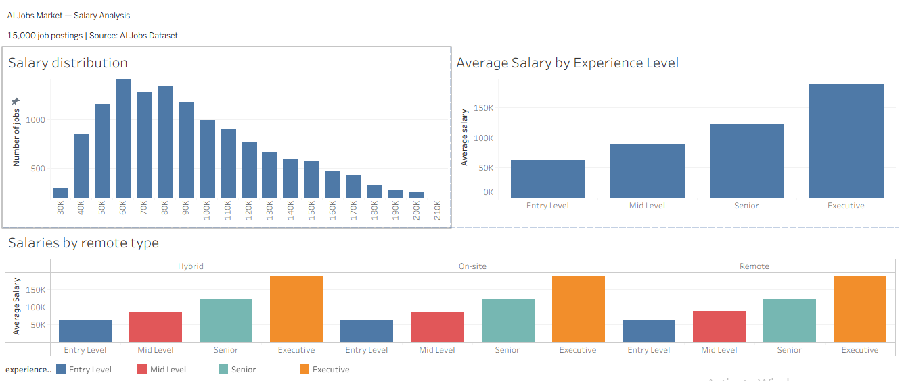

# Dashboard Documentation: Fleet Cost Intelligence
**Project 5 — SilverTrust AI Consulting Simulation**  
**Prepared by:** Pedro  
**Date:** March 2026  
**Tool:** Tableau Desktop  
**File:** `chleo_cost_intelligence_dashboard.twbx`

---

## What this dashboard is for

Chleo doesn't know which trucks are costing her money or why. She gets a fuel bill at the end of the month but has zero visibility into what drove it. This dashboard changes that — it gives her operations manager a single screen to understand fleet costs at a glance, every week.

---

## Data sources

| File | What it contains |
|---|---|
| `processed_costs.csv` | Monthly cost per truck: fuel, tolls, maintenance, fixed costs |
| `processed_freight.csv` | Trip-level revenue and weight per delivery |
| `dim_drivers.csv` | Driver names linked to Driver IDs |
| `dim_vehicles.csv` | Truck plate, brand, type, year linked to Truck IDs |

All four tables are connected in Tableau via relationships — `processed_costs` is the root table, the three others join to it on `Driver ID` or `Truck ID`.

---

## Dashboard layout

The dashboard has three charts on one page:

**Top — Fuel cost per truck (ranked bar chart)**
Every truck in the fleet ranked by total fuel spend, highest to lowest. Truck 17 is the clear outlier at ~€132,000 — more than 40% above the next highest truck. This is the first thing Chleo sees when she opens the dashboard.

**Bottom left — Fuel consumption over time (line chart)**
Monthly fleet-wide fuel spend from January 2018 to August 2019. Shows seasonality and anomalies. The October 2018 spike to €72,356 is the single highest month — worth investigating. The flat period November 2018 – February 2019 at €25,219 reflects missing data in the synthetic dataset.

**Bottom right — Detailed costs (stacked bar chart)**
Monthly breakdown of all four cost categories: Fixed Costs (blue), Fuel (orange), Maintenance (red), Tolls (teal). Fixed costs dominate — this is normal for a trucking SME where fleet depreciation and driver salaries are the largest expense. Fuel is the second largest and the most controllable.

---

## Key metrics

| Metric | Value | Why it matters |
|---|---|---|
| Total fuel spend | €901,895 | Single largest controllable cost |
| Top fuel truck (Truck 17) | €132,736 | 47% above fleet average — anomaly |
| Peak fuel month | October 2018 (€72,356) | Needs route/load investigation |
| Fixed costs vs fuel ratio | ~3:1 | Fuel is 25% of total — high leverage |

---

## How to use the dashboard

**Filter by truck:** Click any bar in the "Fuel cost per truck" chart — the other two charts automatically filter to show only that truck's data. This is the most powerful feature for drilling into a specific anomaly.

**Filter by date:** The time axis on the line chart is scrollable. Drag to zoom into a specific period.

**Hover for detail:** Hovering over any bar or data point shows the exact value in a tooltip.

**Navigation:** Three sheet tabs at the bottom — "Fuel cost per truck", "Fuel consumption over time", "Detailed costs" — let you view each chart full screen.

---

## Design decisions

**Why ranked bar for trucks?** The operations manager needs to know immediately which truck to investigate. A ranked chart makes the worst offender obvious in under 2 seconds — no mental processing required.

**Why a line chart for time?** Fuel costs have seasonality and trends. A bar chart per month would hide the trend shape. The line makes it immediately visible that October 2018 was an anomaly, not part of a trend.

**Why stacked bars for cost breakdown?** The question being answered is "what is each month's total cost made of?" Stacked bars show both the total height and the proportional split simultaneously. A grouped bar would make totals harder to read.

**Why one page?** Following dashboard communication layer principles — one screen, one story. Chleo should not need to navigate between pages to understand her fleet's cost situation.
