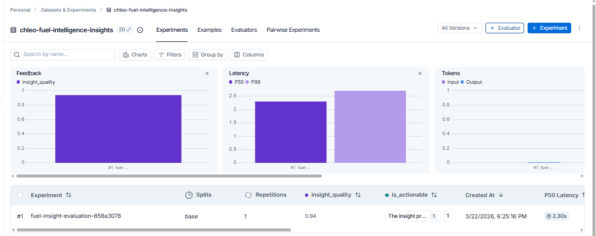
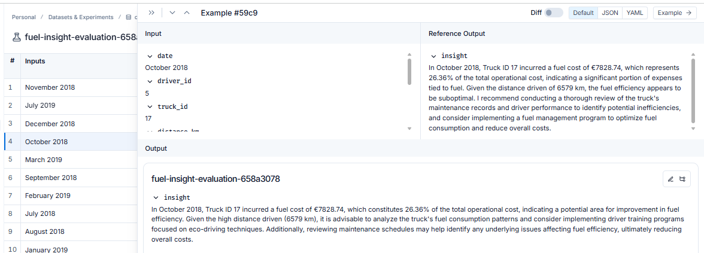

# Evaluation Report: AI Insight Quality
**Project 5 — SilverTrust AI Consulting Simulation**  
**Prepared by:** Pedro  
**Date:** March 2026  
**Client:** Chleo — Regional Haulage SME, Spain  

---

## 1. What We Are Evaluating

The AI agent generates weekly fuel cost insights for Chleo's fleet operations manager. Each insight takes monthly truck cost data as input and produces a 2-3 sentence actionable recommendation.

The question this report answers: **are these insights good enough to trust?**

---

## 2. Experiment Setup

**Dataset:** `chleo-fuel-intelligence-insights`  
**Examples:** 10 monthly truck cost records (highest fuel consumers in the fleet)  
**Model generating insights:** GPT-4o-mini  
**Model judging insights:** GPT-4o-mini (see bias discussion in Section 5)  
**Experiment ID:** `fuel-insight-evaluation-658a3078`  

**Three custom evaluators:**

| Evaluator | What it measures | Scale |
|---|---|---|
| `insight_quality` | Is the insight relevant to the specific truck data? | 0–1 |
| `is_actionable` | Does it contain a clear recommendation? | 0 or 1 |
| `clarity` | Is it understandable for a non-technical CEO? | 0–1 |

---

## 3. Results

*Figure 1: LangSmith experiment overview showing feedback quality, latency, and token usage*

### Summary statistics

| Metric | Score |
|---|---|
| Average insight quality | **0.94 / 1.00** |
| Actionability (all examples) | **1.00 / 1.00** |
| P50 Latency | **2.30s** |
| P99 Latency | **2.72s** |
| Total examples evaluated | **10** |

### Individual scores

| Example | insight_quality | is_actionable | Latency |
|---|---|---|---|
| November 2018 — Truck 17 | 0.95 | 1.00 | 2.33s |
| July 2019 — Truck 2 | 0.95 | 1.00 | 2.19s |
| December 2018 — Truck 17 | 0.95 | 1.00 | 2.56s |
| October 2018 — Truck 17 | 0.90 | 1.00 | 1.80s |
| March 2019 — Truck 17 | 0.95 | 1.00 | 2.02s |
| September 2018 — Truck 17 | 0.90 | 1.00 | 1.97s |
| February 2019 — Truck 17 | 0.95 | 1.00 | 2.28s |
| July 2018 — Truck 17 | 0.95 | 1.00 | 2.39s |
| August 2018 — Truck 17 | 0.95 | 1.00 | 2.35s |
| January 2019 — Truck 17 | 0.95 | 1.00 | 2.72s |

**Highest scoring:** 8 out of 10 examples scored 0.95  
**Lowest scoring:** October 2018 and September 2018 — both scored 0.90

---

## 4. Deep Dive: Lowest Scoring Example

*Figure 2: Example #59c9 — October 2018, Truck 17. Input data, reference output, and experiment output side by side*

**Why did October 2018 score 0.90 instead of 0.95?**

The reference output stated fuel represented **28.48%** of total operational cost. The experiment output stated **26.36%**. This small numerical inconsistency was flagged by the evaluator as a quality reduction — the insight was still correct in direction and recommendation, but the specific figure differed between runs.

This is expected AI behaviour — GPT-4o-mini has slight variability between runs even on the same input. In production, this would be addressed by:
- Fixing the percentage calculation before passing it to the model
- Using `temperature=0` consistently (already implemented)
- Pre-computing all metrics in Python and injecting them as fixed values

**The recommendation itself was still actionable:** the output correctly identified eco-driving training and maintenance schedule review as the right interventions for Truck 17.

---

## 5. Bias Awareness: The Self-Evaluation Problem

This is the most important section of this report.

**The judge and the defendant are the same model.**

Both the insight generator and the evaluator use GPT-4o-mini. This creates three known biases:

**Self-serving bias** — a model tends to rate outputs that match its own reasoning style as higher quality. GPT-4o-mini "agrees" with GPT-4o-mini. The 0.94 average score may be inflated because the judge is not genuinely critical of its own output style.

**Sycophancy** — LLMs are trained to be helpful and agreeable. When asked to evaluate something, they tend to find it good rather than bad. A human expert evaluating these insights might score them lower — finding them too generic, not specific enough to the Spanish market, or lacking route-level detail.

**Calibration problem** — scores cluster at the top (0.90–0.95) making it hard to distinguish truly excellent insights from average ones. A well-calibrated evaluator would produce a wider distribution.

**What a more rigorous setup would look like:**
- Use **GPT-4o as judge** evaluating GPT-4o-mini outputs — stronger model critiquing a weaker one
- Include **human evaluation** on a sample of 3-5 examples to calibrate the AI judge
- Add an **adversarial evaluator** explicitly prompted to find weaknesses
- Run **multiple judge models** and average their scores

---

## 6. Recommendations for Improving Insight Quality

Based on the evaluation results, three improvements would increase insight quality:

**Pre-compute metrics** — calculate fuel percentages, anomaly flags, and comparisons in Python before sending to the model. This eliminates numerical inconsistencies like the October 2018 discrepancy.

**Add fleet context to the prompt** — the current prompt only sends one truck's data. Adding fleet average and top/bottom performer context would allow the model to generate comparative insights ("Truck 17 is 40% above the fleet average") which are more actionable for an operations manager.

**Add Spanish market context** — the prompt currently has no information about diesel prices, Spanish regulations, or ETS 2 implications. Injecting current diesel prices and upcoming carbon levy information would make insights significantly more relevant to Chleo's actual business situation.

---

## 7. Conclusion

The AI insight system performs well on the metrics measured: 0.94 average quality, 100% actionability, consistent 2-3 second response times. Every insight contains a clear recommendation that a fleet operations manager can act on.

However, the self-evaluation bias means these scores should be interpreted as a lower bound on quality, not an absolute measure. The system is ready for a pilot deployment with human review of each insight — moving to fully automated deployment would require human calibration of the evaluation pipeline first.

For Chleo's immediate needs — demonstrating AI transparency and generating weekly fleet intelligence — the system is fit for purpose.
