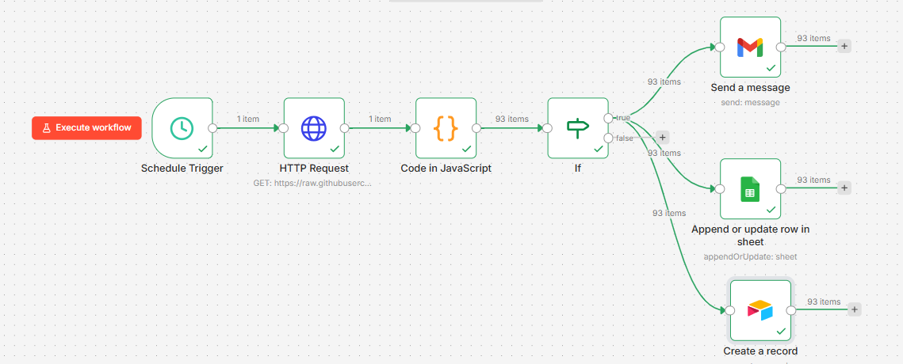

# Workflow Documentation: Fuel Anomaly Alert
**Project 5 — SilverTrust AI Consulting Simulation**  
**Prepared by:** Pedro  
**Date:** March 2026  
**Tool:** n8n Cloud  
**File:** `workflow.json`  
**Workflow name:** Fuel Anomaly Alert — Chleo SME

---

## What this workflow does

Every morning at 8am, this workflow automatically checks Chleo's entire fleet for fuel anomalies. Any truck burning more than 20% above the fleet average triggers three simultaneous actions: an email alert to the operations manager, a row logged to Google Sheets, and a record created in Airtable. Zero manual work required.



---

## Node breakdown

### Node 1 — Schedule Trigger
**Type:** Schedule  
**Config:** Daily at 8:00 AM  

The starting point. Fires once per day automatically. In production this would run against yesterday's data only — in this demo it runs against the full historical dataset.

---

### Node 2 — HTTP Request
**Type:** HTTP Request  
**Method:** GET  
**URL:** Raw GitHub URL of `processed_costs.csv`  

Fetches the fleet cost CSV directly from GitHub. In a real engagement this would be replaced with a direct API call to the client's TMS or fuel card provider (DKV, UTA, Webfleet). The HTTP node makes this swap trivial — just change the URL.

---

### Node 3 — Code in JavaScript
**Type:** Code (JavaScript)  
**Purpose:** Anomaly detection engine  

This is the brain of the workflow. Here is what it does step by step:

```javascript
// 1. Parse the CSV text into rows
const lines = csvText.split('\n');
const headers = lines[0].split(',');

// 2. Build an array of truck cost objects
const truckData = [];
for (let i = 1; i < lines.length; i++) {
  // converts each row into a key-value object
}

// 3. Calculate fleet average fuel
const avgFuel = fuelValues.reduce((a, b) => a + b, 0) / fuelValues.length;

// 4. Set anomaly threshold at 20% above average
const threshold = avgFuel * 1.2;

// 5. Filter trucks that exceed the threshold
const anomalies = truckData.filter(r => parseFloat(r['Fuel']) > threshold);

// 6. Return one item per anomalous truck with enriched data
return anomalies.map(truck => ({
  json: {
    truckId, fuel, avgFuel, threshold, percentAboveAvg, date, driverId
  }
}));
```

**Why JavaScript and not Python?** n8n's native scripting language is JavaScript. It runs inside the n8n engine without any external dependencies — no virtual environment, no pip installs. Python is available in n8n but still experimental and less stable for production workflows.

**Why 20% threshold?** This is a configurable business rule. 20% above average captures genuine anomalies without creating too much noise. In production, Chleo's operations manager would calibrate this — 10% might be too sensitive, 30% might miss real problems.

**Output:** 93 anomalous truck-month records from the historical dataset. In daily production this would typically be 3-8 per day.

---

### Node 4 — IF
**Type:** Conditional  
**Condition:** `percentAboveAvg > 20`  

Routes the flow. If anomalies exist → true branch (send alerts). If no anomalies today → false branch (stop, do nothing). This prevents the workflow from sending empty alerts on quiet days.

---

### Node 5a — Send a message (Gmail)
**Type:** Gmail  
**Action:** Send message  
**To:** Operations manager email  
**Subject:** `⚠️ Fuel Anomaly Detected — Truck {{ $json.truckId }}`  

Sends one email per anomalous truck containing: date, truck ID, driver ID, fuel cost, fleet average, and % above average. The operations manager can reply directly or investigate in Tableau.

---

### Node 5b — Append or update row in sheet (Google Sheets)
**Type:** Google Sheets  
**Action:** Append row  
**Sheet:** Fuel Anomaly Log  

Logs every anomaly to a persistent Google Sheet with columns: Date, Truck ID, Fuel Cost, % Above Average, Driver ID. This creates a running audit trail — Chleo can see anomaly trends over weeks and months.

---

### Node 5c — Create a record (Airtable)
**Type:** Airtable  
**Action:** Create record  
**Base:** Fuel Anomaly Log  

Same data as Google Sheets, written to Airtable simultaneously. This demonstrates the workflow's flexibility — clients using Airtable as their operations tool get the same alerts without any extra configuration. Both destinations run in parallel on the true branch.

---

## Business value

**Before this workflow:** Operations manager spends 45 minutes/day manually checking fuel reports, calling drivers, updating spreadsheets. Anomalies are discovered at month-end, too late to act.

**After this workflow:** Anomalies are detected same-day. Operations manager receives a specific alert with the truck ID and percentage deviation. Total daily time: 0 minutes manual work, 5 minutes reading and responding to alerts.

**Estimated saving:** ~€281/month in operations manager time. Payback period: 9 days.

---

## How to import and run

1. Open your n8n instance
2. Click **+** to create a new workflow
3. Click **...** → **Import from file** → select `workflow.json`
4. Configure credentials:
   - Gmail OAuth2
   - Google Sheets OAuth2
   - Airtable Personal Access Token
5. Update the HTTP Request URL to your actual data source
6. Click **Activate** to enable the daily schedule
